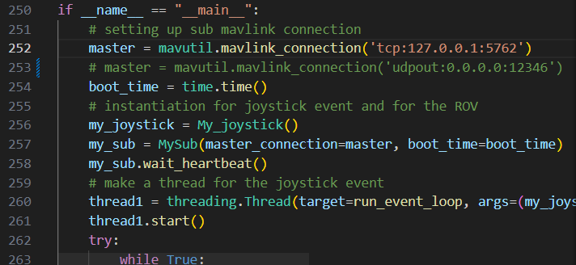
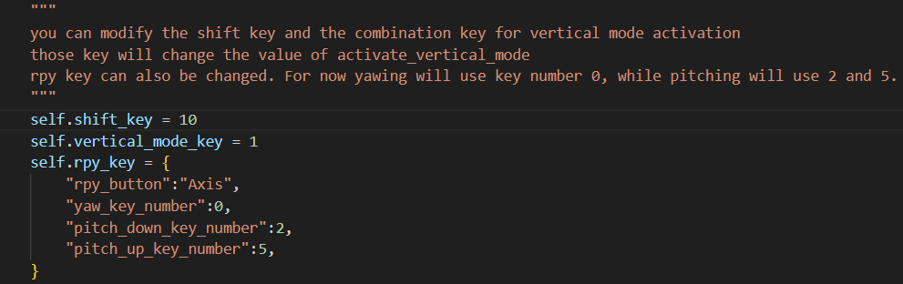

# Connection Modification
Navigate to the mavlink connection [code](set_pitch_with_controller.py) and modify the pymavlink connection to the ROV.

# Key Button Modification
On default, the key used to activate the vertical mode is by shift (key 10) + B (key 1)
while the yaw using the Left Joystick (Axis 0) and pitch down and pitch up use the LT (key 2) and RT (key 5)
You can change the key accordingly.

To know the key number and its type, go to key_received on the My_joystick class and uncomment the commented code.

<!--  -->
