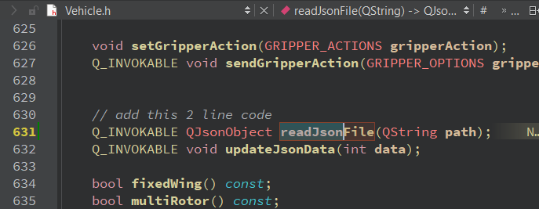
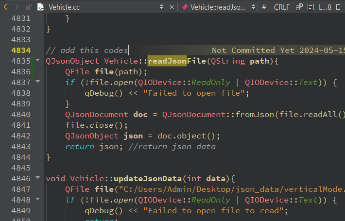
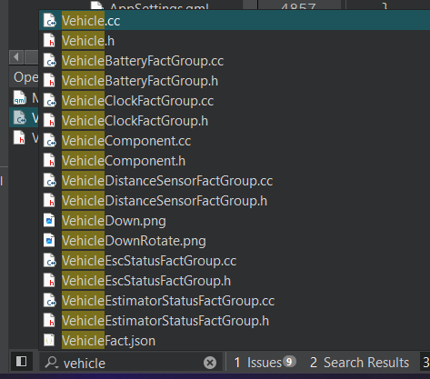

# QT BackEnd Modification
Navigate and open Vehicle.h, insert this 2 line of code inside Vehicle class >> Public <br>

```
    Q_INVOKABLE QJsonObject readJsonFile();
    Q_INVOKABLE void updateJsonData(int data);
```


Navigate and open Vehicle.cc, and insert these lines of codes:
```
QJsonObject Vehicle::readJsonFile(){
    QFile file("C:/Users/Admin/Desktop/json_data/verticalMode.json");
    if (!file.open(QIODevice::ReadOnly | QIODevice::Text)) {
        qDebug() << "Failed to open file";
    }
    QJsonDocument doc = QJsonDocument::fromJson(file.readAll());
    file.close();
    QJsonObject json = doc.object();
    return json; //return json data
}

void Vehicle::updateJsonData(int data){
    QFile file("C:/Users/Admin/Desktop/json_data/verticalMode.json");
    if (!file.open(QIODevice::ReadOnly | QIODevice::Text)) {
        qDebug() << "Failed to open file to read";
        return;
    }
    QJsonDocument doc = QJsonDocument::fromJson(file.readAll()); //reading the data
    file.close();
    if (!file.open(QIODevice::WriteOnly | QIODevice::Text)) {
        qDebug() << "Failed to open file to write";
        return;
    }
    QJsonObject json = doc.object();
    json["isVerticalActive"] = data; // changing the value using parameter
    doc.setObject(json); //change the document value
    file.write(doc.toJson(QJsonDocument::JsonFormat::Indented)); //write to the file
    file.encodeName("UTF-8");
    file.close();
    qDebug() << "JSON modified and saved successfully!";
}
```



# QT FrontEnd Modification
Navigate to ModeIndicator.qml and modify/replace with this
[ModeIndicator.qml](./assets/qml/ModeIndicator.qml)


## Tips:
to navigate use the search on QT Creator App
