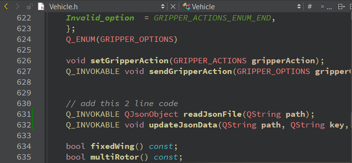
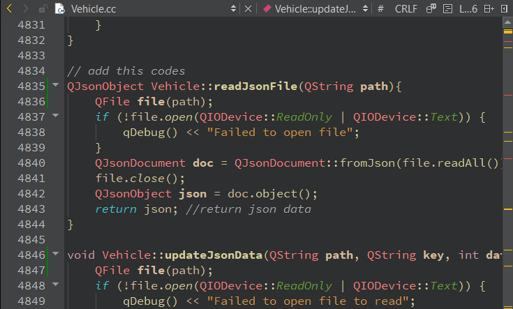

# QT BackEnd Modification
This steps is required if you want to integrate the python control code to the QGC. QGC will show whether the cleaning mode is activated or not, and also can activate the cleaning mode by GUI itself.

If this step is not followed, cleaning mode can only be activated by joystick (not GUI)

## Modification of Vehicle.h
Navigate and open Vehicle.h, insert this 2 line of code inside Vehicle class >> Public <br>

```
    Q_INVOKABLE QJsonObject readJsonFile(QString path);
    Q_INVOKABLE void updateJsonData(QString path, QString key, int data);
```


## Modification of Vehicle.cc
Navigate and open Vehicle.cc, and insert these lines of codes:
```
QJsonObject Vehicle::readJsonFile(QString path){
    QFile file(path);
    if (!file.open(QIODevice::ReadOnly | QIODevice::Text)) {
        qDebug() << "Failed to open file";
    }
    QJsonDocument doc = QJsonDocument::fromJson(file.readAll());
    file.close();
    QJsonObject json = doc.object();
    return json; //return json data
}

void Vehicle::updateJsonData(QString path, QString key, int data){
    QFile file(path);
    if (!file.open(QIODevice::ReadOnly | QIODevice::Text)) {
        qDebug() << "Failed to open file to read";
        return;
    }
    QJsonDocument doc = QJsonDocument::fromJson(file.readAll()); //reading the data
    file.close();
    if (!file.open(QIODevice::WriteOnly | QIODevice::Text)) {
        qDebug() << "Failed to open file to write";
        return;
    }
    QJsonObject json = doc.object();
    json[key] = data; // changing the value using parameter
    doc.setObject(json); //change the document value
    file.write(doc.toJson(QJsonDocument::JsonFormat::Indented)); //write to the file
    file.encodeName("UTF-8");
    file.close();
    qDebug() << "JSON modified and saved successfully!";
}
```



## QT FrontEnd Modification
Navigate to ModeIndicator.qml and modify/replace with this file
[ModeIndicator.qml](./assets/qml/ModeIndicator.qml).

[JSON file](/vertical_movement_joystick/verticalMode.json) by default is stored in the same path where the main python script is located. If you extract this to desktop, the path should be like this 
`C:/Users/<yourcomputername>/Desktop/RovoVertical/vertical_movement_joystick/verticalMode.json`.

Search for path property in the [ModeIndicator.qml](./assets/qml/ModeIndicator.qml), and change it accordingly.

## Other
### Tips:
to navigate use the search on QT Creator App


### Limitation:
Reading JSON file can use the readJsonFile method. This method can read the JSON file and will return JSON data. Method updateJsonData to update the JSON data is made specifically for vertical movement. To make it universal, there should be some modification to it. To update other JSON file you can just make other method for other function.